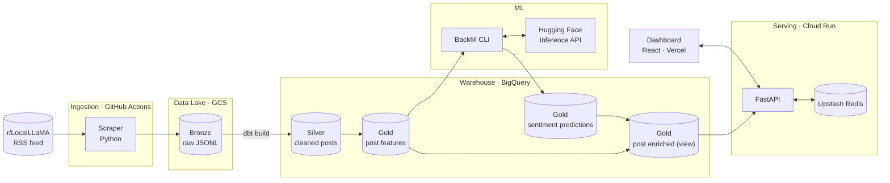
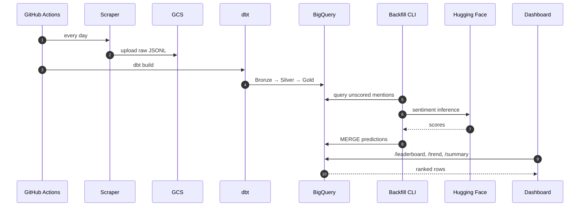

# Local LLM Sentiment Tracker

[](https://github.com/dung0-o/llm-pulse-platform/actions/workflows/ci.yml)
[](https://www.python.org/downloads/release/python-3110/)
[](https://nodejs.org/)
[](LICENSE)

Real-time sentiment analytics for open-weight language models, built from public Reddit discussions on [r/LocalLLaMA](https://reddit.com/r/LocalLLaMA).

**Live demo**: https://llm-pulse-platform.vercel.app/

## Overview

Every week a new open-weight model ships - Qwen, Gemma, Llama, DeepSeek, Mistral - and every week the community's verdict is scattered across hundreds of Reddit threads. Benchmarks tell you what a model can do. Social platforms tell you whether anyone actually enjoys using it.

This project aggregates that second signal into a single, queryable source of truth: which models the community is talking about, how positively, and how that changes over time.

## Architecture



## Data flow

A single pipeline run:



## Key features

### Data Engineering

- **Medallion architecture** - Bronze (raw JSONL in GCS), Silver (cleaned, deduplicated), Gold (feature-engineered, mention-exploded)
- **dbt-managed transformations** - seeds, generic tests, singular tests, and incrementally materialized tables
- **Generated single source of truth** - `config/models.yaml` drives both the dbt seed and the frontend constants via `scripts/generate_model_list.py`
- **Idempotent backfill** - a batch `MERGE` keyed on `mention_id`, running in one statement instead of thousands of per-row updates

### NLP / ML

- **Aspect-based sentiment** - every post is exploded into one row per mentioned model family, then classified with a DeBERTa ABSA model via the Hugging Face Inference API
- **Weighted Score** - utilise Bayesian Weighted Score (famously used for IMDb rating) to prevent models with few mentions from dominating the list

### Serving

- **FastAPI on Cloud Run** - scale-to-zero, 512 MB, single-instance ceiling to stay within the GCP free tier
- **Redis caching** - 6-hour TTL on rankings, with a `?refresh=true` bypass for the UI
- **Flexible inference backend** - toggled by `INFERENCE_BACKEND=huggingface|local`, so the same code runs against a remote API or a locally-hosted model

### Frontend

- **React + Vite + TypeScript** - deployed on Vercel's edge
- **Five views** - leaderboard, model trend, share of voice with family-hue coloring, posts search, system health
- **Light/Dark mode** - respects system preference, persisted to `localStorage`

## Tech stack

| Layer | Tool | Hosted |
| :--- | :--- | :--- |
| Orchestration | GitHub Actions (cron) | GitHub |
| Scraper | `feedparser`, `httpx`, `google-cloud-storage` | GitHub runners |
| Data lake | Google Cloud Storage | GCP |
| Warehouse | BigQuery | GCP |
| Transformations | dbt-core + dbt-bigquery | Runs locally, executes in BigQuery |
| Model serving | Hugging Face Inference API | Hugging Face |
| Backend | FastAPI + uvicorn | Cloud Run |
| Cache | Upstash Redis | Upstash |
| Frontend | React + Vite + Tailwind + Recharts | Vercel |

## Quick start

Requires Python 3.11+, Node 24+, Docker, and the `gcloud` CLI.

```bash
# 1. Clone and install
git clone https://github.com/dung0-o/llm-pulse-platform.git
cd llm-pulse-platform
make install

# 2. Configure
cp .env.example .env
# edit .env with your project, bucket, dataset, and API keys

# 3. Authenticate to GCP
gcloud auth application-default login

# 4. Run the full pipeline locally
make bootstrap      # Provision BigQuery tables and the GCS bucket
make seed           # Load the model-list seed
make scrape         # Scrape once and run dbt
make run            # Run FastAPI + Vite together
```

Opens FastAPI at `http://localhost:8000` and the Vite dev server at `http://localhost:5173`. Both read from the root `.env` file.

## Project structure

```
llm-pulse-platform/
├── api/                  FastAPI service (Cloud Run)
│   ├── jobs/             CLI entrypoints (backfill)
│   └── Dockerfile
├── scraper/              RSS scraper (GitHub Actions)
├── dbt/                  Transformations (Bronze → Silver → Gold)
│   ├── models/
│   ├── seeds/
│   └── tests/
├── dashboard/            React + Vite frontend (Vercel)
├── infra/                Provisioned BigQuery tables, Cloud Run service
├── config/models.yaml    Single source of truth for tracked families
├── scripts/              Bootstrap, generation, and orchestration helpers
├── tests/                pytest suite
└── docs/                 Architecture and design documentation
```

## Development

| Task | Command |
| :--- | :--- |
| Install all dependencies | `make install` |
| Run API + dashboard | `make run` |
| Run scraper once | `make scraper` |
| Run dbt build | `make dbt` |
| Regenerate seed and frontend constants | `make generate` |
| Backfill null sentiments | `make backfill` |
| Run all tests | `make test` |
| Run linter | `ruff check .` |

## Testing

```bash
make test
```

Runs four suites:

- **Python unit tests** (`tests/unit/`) - regex builders, score mapping
- **Python integration tests** (`tests/integration/`) - FastAPI endpoints with mocked BigQuery and Redis, backfill deduplication
- **dbt tests** (`dbt/models/**/schema.yaml`, `dbt/tests/`) - referential integrity, uniqueness, accepted values
- **TypeScript tests** (`dashboard/src/**/*.test.ts`) - numeric coercion, color generation

CI runs all four on every pull request. See [docs/09_TESTING.md](docs/09_TESTING.md) for the strategy.

## Deployment

| Component | Target | Trigger |
| :--- | :--- | :--- |
| Scraper + dbt | GitHub Actions cron | Every day |
| API | Cloud Run | Push to `main` under `api/**` |
| Dashboard | Vercel | Push to `main` under `dashboard/**` |
| Backfill | Manual / Cloud Run Job | On demand |

Full setup instructions, secret creation, and free-tier budgeting are in [docs/07_DEPLOYMENT.md](docs/07_DEPLOYMENT.md).

## Design decisions

A few choices that are not obvious from the code:

- **Feature/prediction split.** `gold_post_features` is rebuilt by dbt on every run. Sentiment predictions live in a separate table written by the backfill job. This separation means a dbt rebuild never wipes expensive ML output, and the ML model can be swapped without touching the transformation layer.
- **ELT, not ETL.** Raw JSONL lands in GCS unmodified. Every transformation is a SQL model that can be re-run against the same Bronze data if the extraction logic changes.
- **SHA-tagged images.** Every Cloud Run revision is tagged with its commit SHA, so rollback is `gcloud run services update-traffic --to-revision=<sha>`.
- **Free tier throughout.** The whole system runs on free tiers with a single-instance ceiling on Cloud Run. The math is in [docs/08_OPERATIONS.md](docs/08_OPERATIONS.md).

Full list of decisions: [docs/decisions/](docs/decisions/)

## Documentation

- [Architecture](docs/00_ARCHITECTURE.md)
- [Data model](docs/01_DATA_MODEL.md)
- [dbt transformations](docs/02_DBT_TRANSFORMATIONS.md)
- [API specification](docs/03_API_SPEC.md)
- [Dashboard](docs/04_DASHBOARD.md)
- [Inference backends](docs/06_INFERENCE_BACKENDS.md)
- [Deployment](docs/07_DEPLOYMENT.md)
- [Operations](docs/08_OPERATIONS.md)
- [Testing](docs/09_TESTING.md)

## License

[MIT](LICENSE)
