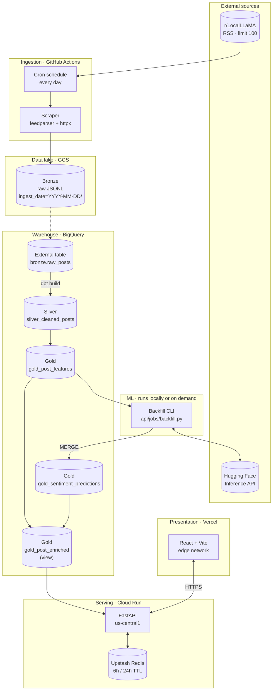
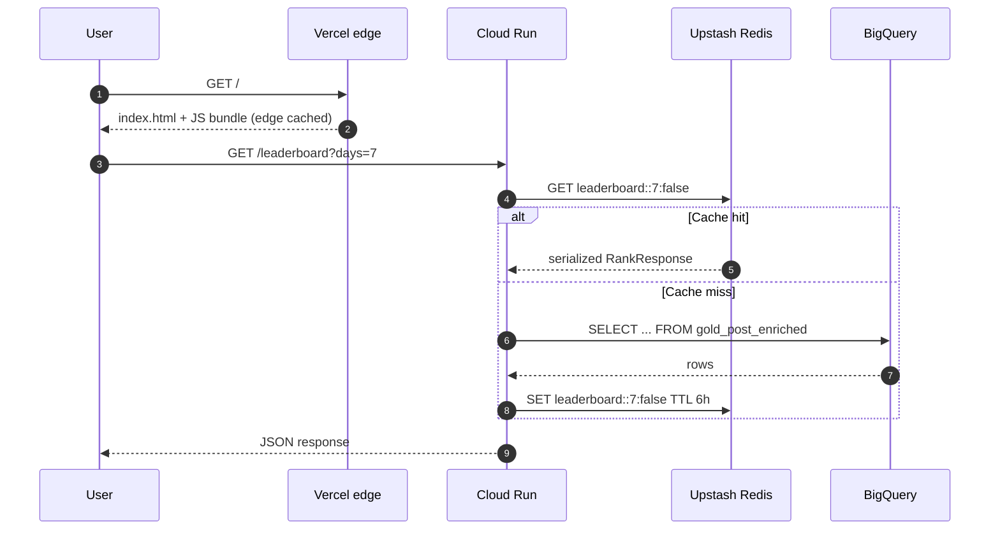

# Architecture

## Purpose

A continuous pipeline that scrapes open-weight LLM discussion from r/LocalLLaMA, classifies sentiment toward each mentioned model family and version, and serves a public dashboard ranking models by community reception.

The project is a portfolio piece. That constraint shaped every decision below: every component runs on a free tier, every transformation is reproducible from raw data, and every non-obvious choice is documented.

## System diagram

## Request lifecycle

A single `GET /leaderboard?days=7` from a user in Singapore:

## Component responsibilities

| Component | Owns | Reads | Writes |
| :--- | :--- | :--- | :--- |
| **Scraper** | Fetching RSS, parsing to JSONL | r/LocalLLaMA RSS | GCS Bronze |
| **dbt** | Cleaning, deduplication, feature extraction, mention explosion | Bronze external table, `model.gold_sentiment_predictions` | Silver, `gold_post_features` |
| **Backfill** | Sentiment inference, prediction persistence | `gold_post_features` | `gold_sentiment_predictions` |
| **API** | HTTP contract, caching, request validation | `gold_post_enriched` | Redis |
| **Dashboard** | UI rendering, client-side routing | API | - |

The critical boundary is between `gold_post_features` and `gold_sentiment_predictions`:
- dbt owns features. It rebuilds them from scratch on every run.
- The backfill job owns predictions. It upserts into them and never touches the feature table.

This separation means a `dbt run --full-refresh` wipes and rebuilds features without destroying sentiment scores, and swapping the inference model requires no changes to dbt.

## Deployment topology

| Component | Region | Trigger |
| :--- | :--- | :--- |
| GCS bucket | `us-central1` | Uploaded by scraper |
| BigQuery dataset | `us-central1` | Written by dbt, backfill |
| Cloud Run service | `us-central1` | Deploy on push to `main` under `api/**` |
| Artifact Registry | `us-central1` | Pushed by deploy workflow |
| Upstash Redis | `us-central-1` | Managed by Upstash |
| Vercel project | Global edge | Deploy on push to `main` under `dashboard/**` |

Everything is in `us-central1` except the Vercel edge. The API and BigQuery are co-located so queries do not cross regions. The Vercel edge is global by design.

## Failure modes

| Failure | Effect | Detection | Recovery |
| :--- | :--- | :--- | :--- |
| Hugging Face rate limit | Backfill slows or stalls | Log error, `failed` count in job summary | Retry after the window resets; fall back to local inference |
| BigQuery quota exhausted | Queries fail with 403 | `/health` reports `bigquery: error` | Wait for the daily reset |
| Redis unavailable | Every request hits BigQuery | `/health` reports `redis: disconnected` | Automatic - Redis is a cache, not a source of truth |
| Cloud Run cold start | First request takes ~4 s | Latency spike in logs | `minScale: 0` is intentional; the trade-off is documented |
| Model list edit without backfill | Orphan predictions | `assert_no_orphan_predictions` dbt test fails | `make backfill` purges and re-scores |

The system is designed so that each failure degrades rather than breaks. Redis is optional. Hugging Face has a local fallback. BigQuery exhaustion is a hard stop, but the fix is waiting.

## Constraints

The whole system runs on free tiers. The specific numbers:

| Service | Limit | Current usage |
| :--- | :--- | :--- |
| GitHub Actions | 2,000 min/month (private) or unlimited (public) | ~240 min/month used |
| GCS storage | 5 GB | ~100 MB/month growth, 90-day retention |
| BigQuery storage | 10 GB active | < 500 MB |
| BigQuery queries | 1 TB/month | < 5 GB/month |
| Cloud Run | 2M requests, 180k vCPU-s, 360k GiB-s | ~10% used |
| Artifact Registry | 500 MB | ~100 MB |
| Upstash Redis | 10k commands/day | ~1k/day |
| Hugging Face | ~30k requests/month | ~4k/month |
