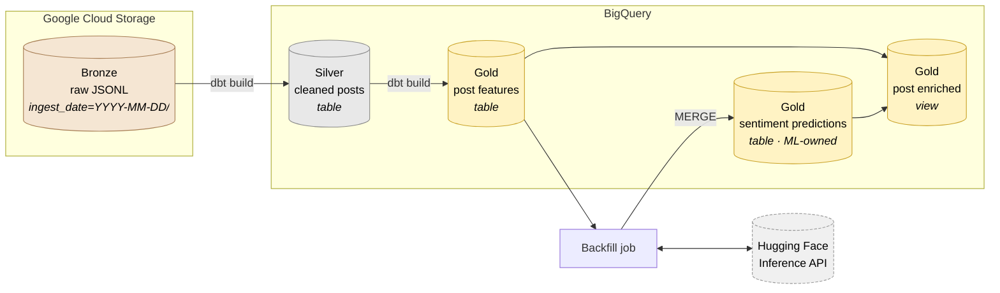

# Data model

## Overview

Data flows through four layers, following the **Medallion architecture**:



Each layer is a strict superset of refinement over the one before it. Nothing in Silver exists that cannot be reconstructed from Bronze. Nothing in Gold exists that cannot be reconstructed from Silver - **except sentiment predictions**, which come from an external model.

## Bronze

### Storage

Raw RSS entries, one JSON object per line, uploaded by the scraper:

```
gs://BUCKET/ingest_date=YYYY-MM-DD/HH-MM.jsonl
```

The `ingest_date=` prefix is a Hive partition key. BigQuery's external table reads it as a column, which lets queries prune at the storage layer.

### Access

```sql
-- infra/bigquery/raw_posts.sql.tmpl
CREATE EXTERNAL TABLE IF NOT EXISTS
    `${GCP_PROJECT_ID}.${BQ_DATASET_NAME}.raw_posts`
WITH PARTITION COLUMNS (
    ingest_date DATE
)
OPTIONS (
    format = 'NEWLINE_DELIMITED_JSON',
    uris = ['gs://${GCS_BUCKET_NAME}/*'],
    hive_partition_uri_prefix = 'gs://${GCS_BUCKET_NAME}/'
);
```

### Schema

The external table has no declared schema - BigQuery infers column names and types from the JSON. The fields the scraper produces are documented in the scraper README. The important ones:

| Field | Type | Notes |
| :--- | :--- | :--- |
| `id` | string | Full RSS entry ID, e.g. `https://www.reddit.com/r/LocalLlama/t3_1w6aec4` |
| `title` | string | Post title |
| `content` | array | RSS content block; `content[0].value` holds the HTML body |
| `summary` | string | HTML summary, usually identical to `content[0].value` |
| `author` | string | `/u/username` |
| `link` | string | Permalink to the comments page |
| `published` | string | ISO 8601 timestamp |
| `scraped_at` | string | When the scraper ran (added by the scraper) |

### Retention

The GCS bucket has a lifecycle rule deleting objects after **90 days**. This keeps storage under the 5 GB free tier indefinitely and prevents the external table from growing unbounded.

## Silver

### `silver_cleaned_posts`

Materialized as a **table**, incremental on `post_id` with merge strategy.

### Schema

| Column | Type | Derivation | Notes |
| :--- | :--- | :--- | :--- |
| `post_id` | STRING | `REGEXP_EXTRACT(id, r't3_([a-z0-9]+)')` | Primary key |
| `title` | STRING | `TRIM(title)` | Post title |
| `full_text` | STRING | HTML-stripped `content[0].value` | Title + body text with tags removed |
| `author` | STRING | `REGEXP_REPLACE(author, r'/u/', '')` | Username without prefix |
| `url` | STRING | `link` | Permalink to comments |
| `published_at` | TIMESTAMP | `SAFE.PARSE_TIMESTAMP(published)` | Publication time |
| `scraped_at` | TIMESTAMP | From Bronze | When the post was fetched |
| `publish_date` | DATE | `DATE(published_at)` | Partition key |

### Transformation rules

1. **Deduplication.** A post can appear in multiple scrape runs if it stays on the front page. Silver keeps one row per `post_id`, the most recent scrape.
   ```sql
   ROW_NUMBER() OVER (PARTITION BY post_id ORDER BY scraped_at DESC) = 1
   ```
2. **HTML stripping.** `content[0].value` contains `<div>`, `<p>`, `<a>`, and `&#32;` entities. These are removed with `REGEXP_REPLACE` in a sequence that preserves paragraph breaks.
3. **Validation.** Rows with null or empty `title` are dropped. Rows with null `published_at` are dropped.

## Gold

### `gold_post_features`

Materialized as a **table**, partitioned by `publish_date`, clustered by `family`.

The core transformation: one post becomes **one row per mention**, so a post comparing Qwen and Gemma produces two rows.

| Column | Type | Derivation | Notes |
| :--- | :--- | :--- | :--- |
| `mention_id` | STRING | `CONCAT(post_id, '-', model)` | Primary key. See below. |
| `post_id` | STRING | From Silver | Foreign key |
| `title` | STRING | From Silver | For display |
| `mention` | STRING | Regex-extracted model name | E.g. `Qwen-3.8` |
| `brand` | STRING | From `config/models.yaml` | E.g. `Qwen` |
| `model` | STRING | Normalised mention | E.g. `Qwen 3.8` |
| `full_text` | STRING | Title + body text | Input to the sentiment model |
| `publish_date` | DATE | `DATE(published_at)` | Partition key |

### `mention_id` is derived, not assigned

`mention_id` is `post_id || '-' || model`. This is deliberate.

- **Deterministic.** Running the extraction twice on the same post produces the same ID. No sequence, no UUID, no coordination.
- **Self-documenting.** Reading `1w6aec4-Qwen 3.8` tells you the post and the aspect.
- **Cache-friendly.** The backfill's `MERGE` joins on this key, so upserts are idempotent without a separate lookup.

The cost: if `model` changes for any reason - a regex fix, a version normalization rule change - every affected `mention_id` changes, orphaning its predictions. This is handled by `purge_orphan_predictions()` in the backfill job, which runs before every batch.

### `gold_sentiment_predictions`

**Written by the backfill job, not by dbt.** Declared as a source in `dbt/models/sources.yaml` so it can be joined in `gold_post_enriched`.

Created once by `infra/bigquery/gold_sentiment_predictions.sql.tmpl`:

```sql
CREATE TABLE IF NOT EXISTS
    `${GCP_PROJECT_ID}.${BQ_DATASET_NAME}.gold_sentiment_predictions`
(
    mention_id      STRING    NOT NULL,
    sentiment_score FLOAT64   NOT NULL,
    sentiment_label STRING    NOT NULL,
    scored_at       TIMESTAMP DEFAULT CURRENT_TIMESTAMP()
)
PARTITION BY DATE(scored_at)
CLUSTER BY sentiment_label;
```

| Column | Type | Notes |
| :--- | :--- | :--- |
| `mention_id` | STRING | Primary key. Matches `gold_post_features.mention_id`. |
| `sentiment_score` | FLOAT64 | Signed score in `[-1, 1]` |
| `sentiment_label` | STRING | `Positive`, `Negative`, or `Neutral` |
| `scored_at` | TIMESTAMP | When the prediction was written |

### `gold_post_enriched`

A **view** that joins features with predictions:

```sql
SELECT
  f.*,
  p.sentiment_score,
  p.sentiment_label,
FROM {{ ref('gold_post_features') }} AS f
LEFT JOIN {{ source('ml', 'gold_sentiment_predictions') }} AS p
  ON f.mention_id = p.mention_id
```

Properties:

- **No storage.** Views cost nothing to maintain.
- **Always current.** A newly scored prediction is visible immediately.
- **LEFT JOIN.** A post that has not been scored yet appears with `NULL` sentiment. This is what `query_null_sentiment_posts()` looks for.

The API reads **only** from this view. It never queries the two underlying tables directly.

## Partitioning and retention

| Table | Partition | Cluster | Retention |
| :--- | :--- | :--- | :--- |
| `raw_posts` (external) | Hive partition on GCS prefix | - | 90 days (GCS lifecycle) |
| `silver_cleaned_posts` | `DATE(published_at)` | - | 90 days (`partition_expiration_days`) |
| `gold_post_features` | `publish_date` | `brand` | 90 days |
| `gold_sentiment_predictions` | `DATE(scored_at)` | `sentiment_label` | None |

Predictions are not expired. They are cheap (~50 bytes per row) and losing them means re-running inference, which consumes Hugging Face quota.

## Data quality

### dbt tests

Generic tests in `schema.yaml` files:

| Model | Column | Test |
| :--- | :--- | :--- |
| `silver_cleaned_posts` | `post_id` | `not_null`, `unique` |
| `silver_cleaned_posts` | `url` | `not_null`, `unique` |
| `gold_post_features` | `mention_id` | `not_null`, `unique` |
| `gold_post_features` | `post_id` | `relationships` to Silver |
| `gold_post_features` | `brand` | `not_null` |
| `gold_sentiment_predictions` | `sentiment_label` | `accepted_values` `[Positive, Negative, Neutral]` |
| `gold_sentiment_predictions` | `mention_id` | `not_null`, `unique` |

### Singular tests

| File | Assertion |
| :--- | :--- |
| `assert_no_orphan_predictions.sql` | Every prediction's `mention_id` exists in `gold_post_features` |

This is the guard against the model-list drift problem. When it fails, the fix is `make backfill`, which purges orphans and scores new mentions.
